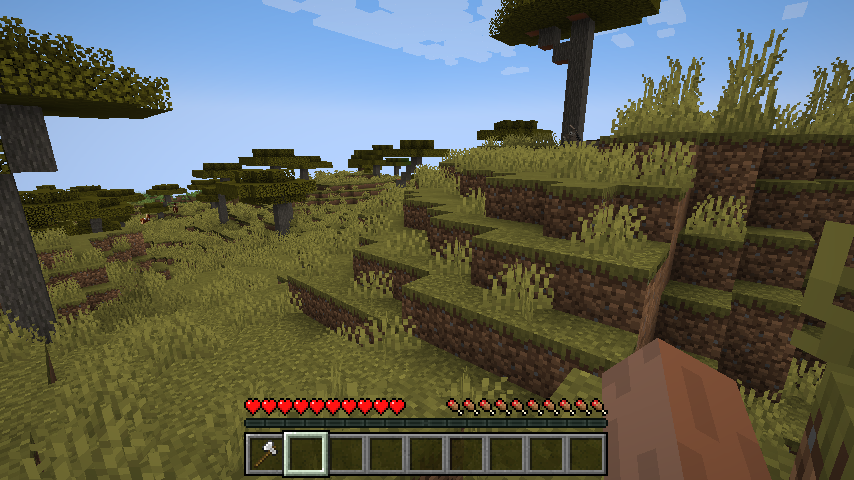
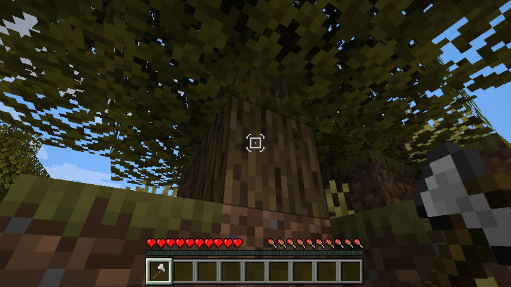

# Dynamic Crosshair

Dynamic Crosshair is a Minecraft mod for the Fabric launcher.
It hides or changes the crosshair dependent on context.

## Features
* Hide the crosshair when not looking at anything.
* Hide or show it depending on what is being looked at.
* Hide or show it depending on the currently equipped item.
* Change the crosshair style for various situations.
* Highly configurable.

## Screenshots
Hides the crosshair when not targetting anything:

Facing a log, wielding an axe, in the default configuration.
The square tool crosshair has a dot to mark this block as breakable,
and there is a rounded bracket around it to indicate a "use" action: stripping the log.

## Installation
This mod has been written for Fabric for Minecraft >= 1.18. It should still work on 1.17, but may have some wrong interaction rules.

Get packaged versions from [Modrinth](https://modrinth.com/mod/dynamiccrosshair) or [Curseforge](https://www.curseforge.com/minecraft/mc-mods/dynamic-crosshair)!

* requires [Fabric API](https://modrinth.com/mod/fabric-api)
* requires [ClothConfig](https://modrinth.com/mod/cloth-config)
* not required: [Mod Menu](https://modrinth.com/mod/modmenu) for ingame configuration screen

## Mod Compatibility
This mod is very strongly coupled to vanilla Minecraft and has to hardcode a lot of interaction rules.
Thus, playing on a non-vanilla world will make the advanced features (context-dependent style) unreliable.

Modded items are forced to have a crosshair active when holding them in the main hand.
There sadly is no general way to differentiate between regular items and tools/weapons.

I highly suggest my other mod [Auto HUD](https://modrinth.com/mod/autohud), which allows to dynamically hide and reveal HUD elements
based on context.

The following mods are incompatible:
* Flour's Various Tweaks (1.18 version) overrides the dynamic crosshair style option. The crosshair will still hide, but not be contextually styled.

If you play with content mods, I recommend also installing [Dynamic Crosshair Compat](https://github.com/Crendgrim/DynamicCrosshairCompat) from [Modrinth](https://modrinth.com/mod/dynamiccrosshaircompat) or [Curseforge](https://www.curseforge.com/minecraft/mc-mods/dynamic-crosshair-compat).
